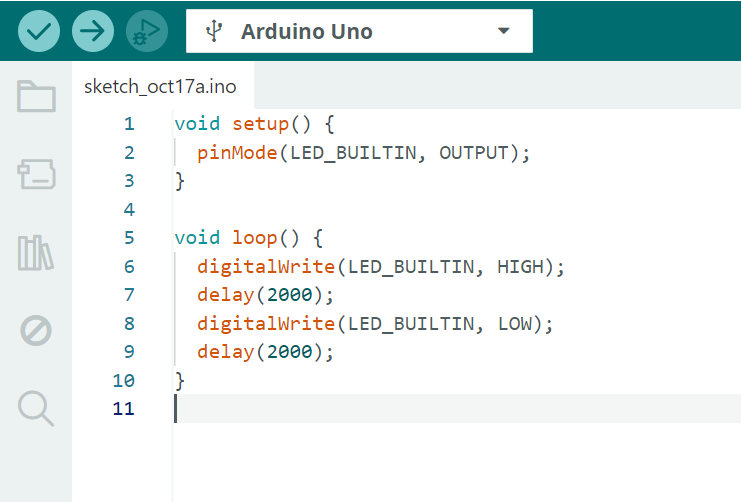

## Projeto LED arduino Módulo 4
Este repositório refere-se à atividade ponderada de programação da semana 1 do módulo 4 do Inteli, dividindo-se em duas etapa explicadas abaixo:<br>
### Parte 1 - Blink Led Interno:
- Nessa parte foi realizado o primeiro teste com o **Arduino UNO**, visando o entendimento de seu funcionamento e ambientação ao **Arduíno IDE**. Para isso, foi feito o **"blink"** do LED interno (L) do Arduíno da seguinte forma:
- Led fica aceso por 2 segundos, apaga durante 2 segundos, e volta a acender por 2 segundos, em loop;
- Função c++ utilizada:
  <div align="center"><sub>Figura 1 - Código do blink do LED.</sub><br>
    <br>
  <sub>Fonte: Material produzido pelo autor, 2025.</sub></div><br>
Nesse código, o led interno `LED_BUILTIN`, é aceso por 2000 milissegundos e depois apagado pelo mesmo período de tempo.<br>
[Link para vídeo e imagem do led interno](https://drive.google.com/drive/folders/1OSJjzZLS8G4sfNer3dqisELsRD68Yjb2?usp=sharing)

### Parte 2 - Simulando Blink Externo:
- Nessa parte foi feita simulação do blink de forma externa, utilizando **TinkerCad**, semelhante a um pisca-pisca, utilizando:
- Protoboard, ligações elétricas, LED, resistor de 20mA e um Arduino;
- Além disso, foi utilizado o seguinte código c++:
```` cpp
void setup() {
  pinMode(13, OUTPUT);

}

void loop() {
  digitalWrite(13, HIGH);
  delay(100);
  digitalWrite(13, LOW);
  delay(100);

}
````

- No código acima, a função `setup` define a porta 13 como a saída (`pinMode(13, OUTPUT)`) e a função `loop` cria um loop que liga o led em `digitalWrite(13, HIGH)`;<br>
[Link para acesso ao projeto no TinkerCad](https://www.tinkercad.com/things/3iInqdllUyL/editel?returnTo=%2Fdashboard%2Fdesigns%2F3d&sharecode=Z5vHRsXItAIUyLFL8H6Gg880Zd7o0o54w3n9KR1cjro)
